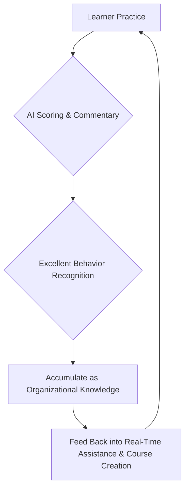

# AI-Native Refactoring of Corporate Training Products

## I. How Traditional Corporate Training Products Operate

The core goal of traditional corporate training products is to deliver standardized content at scale. Their typical form centers around courses, question banks, and exams, organizing learning paths through preset processes.

**In this system:**

*   **Learning Process:** Broken down into a linear flow of "class—practice—exam—assessment";
*   **System Responsibility:** Primarily managing content and progress;
*   **Core Role:** Coaches and instructors bear the real judgment and guidance work;
*   **Metrics:** The focus is on completion rate, pass rate, and coverage.

This model was effective in an era of "knowledge scarcity and limited teaching resources," but it inherently has several **structural limitations:**

*   There is a significant time gap between practice and feedback;
*   Individual differences are difficult to address systematically;
*   Real business scenarios are hard to reproduce with high quality;
*   Training effectiveness stays at "did they learn" and "did they pass," rather than "can they do it."

## II. What is an AI-Native Product

An AI-Native product is not about adding AI features to an existing product, but rather assuming from the start that AI is the system's **intelligent core**.

Its core characteristics are not about "which model is used," but the following **three points:**

*   The system can understand user behavior in real-time;
*   The system can make judgments and provide feedback during interactions;
*   Product processes are not preset, but dynamically generated.

**In AI-Native products:**

*   **AI Role:** No longer a tool or plugin, but a subject that continuously participates in interactions;
*   **Product Positioning:** Not just carrying functions, but a system that can guide, correct, and reinforce behavior;
*   **Value Manifestation:** Not in "what was completed," but in "what change occurred."

## III. How to Build AI-Native Corporate Training Products

Transforming corporate training to AI-Native is essentially shifting from a **"course delivery system" to a "capability-building system"**.

This means **three key transformations:**

1.  **Training Unit Transformation:** From "course/task" as the unit, to one effective practice, one behavioral adjustment as the minimum value unit.
2.  **Interaction Method Transformation:** From clicking and submitting, to natural language dialogue as the core interaction, making practice itself closer to real work scenarios.
3.  **Feedback Mechanism Transformation:** From post-event evaluation, to real-time assistance and process feedback during practice, so learning is corrected and reinforced as it happens.

**Under such a system:**

*   AI takes on the coach role, guiding the learning process in real-time;
*   Learners are no longer just executors, but improve capabilities through trial and error;
*   Organizational experience can be continuously accumulated and fed back into the next round of training.

AI-Native corporate training products ultimately aim not to "finish teaching," but for **"change to occur"**.

## IV. Why Traditional Training Needs "Refactoring" Rather Than "Upgrading"

We believe that the core issue of traditional corporate training products is not content scarcity, but that their core learning mechanism can no longer adapt to the times.

Specifically, facing ever-changing frontline business scenarios, traditional models struggle to exhaust all knowledge points and ensure content always stays close to practice. More importantly, as AI technology matures, knowledge itself is no longer scarce; what's truly valuable is **immediate, actionable, practice-close feedback**. Like a barista in a foreign café immediately offering "Latte?", this feedback is far more effective than post-learning.

Therefore, simply adding AI commentary or content generation to existing training systems is still efficiency optimization under the old paradigm, unable to fundamentally solve the following **core problems:**

*   Insufficient learner practice, practice detached from reality.
*   High course creation costs on the management side, poor content reusability.
*   Learning effectiveness is hard to quantify and continuously improve.

Our choice is not a feature upgrade, but a complete **AI-Native product paradigm shift**.

## V. Core Design Principles

We have established the following **core product principles:**

1.  **Reduce interface interactions, make chat the core**
2.  **Focus on enhancing AI coach intelligence**
3.  **Make AI coaches ubiquitous, smarter with use**

All subsequent feature designs revolve around these three principles.

## VI. Key Refactoring

### 6.1 Real-Time Assistance—Changing the "Practice Process"

#### Traditional Model's Defects

*   Learner practice and learning are disconnected;
*   Gold-standard scripts and excellent examples can only be viewed "after the fact";
*   When practice is most needed, help is most isolated.

#### AI-Native Solution: Real-Time Assistance Mechanism

We introduce a **real-time assistance mechanism** during practice, mainly including:

*   **Stage Goal Hints:** The system can identify current dialogue progress and proactively hint to learners "what is the goal of the current stage" (e.g., during needs discovery, hinting learners to ask more open-ended questions), solving the bottleneck of "not knowing what to say."
*   **Product Information Hints:** When dialogue involves specific product parameters, AI automatically pushes relevant product knowledge to assist learners in accurate responses.
*   **Gold Script Recommendations:** Dynamically recommend excellent scripts based on context, combined with enterprise knowledge base, achieving a "practice while learning" closed loop.

#### Design Trade-offs

We deliberately avoid making AI a "teacher who interrupts anytime," instead:

*   **Only intervene at key decision points;**
*   Provide "optional suggestions," not forced corrections;
*   Preserve learners' trial-and-error space.

> **Learning is not replaced, but amplified.**

### 6.2 Conversational Course Creation—Making "Course Creation" Itself AI-Native

#### Problem Insight

In traditional LMS, course creation is a highly specialized, configuration-intensive task:

*   Trainers need to understand structure, fields, rules;
*   Frontline business experts struggle to participate in content co-creation;
*   High course creation costs lead to slow content updates.

#### Core Decision

We first introduced the **「Conversing with AI is Course Creation」** model, transforming course creation from "configuration behavior" to "expression behavior."

#### Implementation

*   **AI-Driven Knowledge Base Creation Wizard:** Through Q&A wizard, automatically generate knowledge base based on company background information and user answers.
*   **Conversational Course Creation and Editing:** Trainers describe goals, scenarios, and learner profiles in natural language, and AI automatically generates course structure. More importantly, supporting **conversational editing**, users can directly express "I think this customer is too gentle," and AI automatically adjusts role settings, rather than repeatedly entering configuration pages to modify parameters.
*   **What You See Is What You Get:** Left side shows real-time preview of course structure and content, right side converses with AI assistant for adjustments, greatly reducing cognitive load.

#### Product Thinking

The key here is not "generating content," but **lowering the cognitive threshold:**

> If a system can only be used by experts, it can never become the infrastructure of organizational capability.

### 6.3 Learner Self-Practice (UGC)—Refactoring Content Production Mechanism

#### Why UGC

In real business, the most valuable cases often come from the frontline:

*   New customer objections;
*   On-the-spot response methods;
*   Non-standard scenarios.

In traditional systems, this content is hard to structure and accumulate.

#### Our Approach

*   **C-Side Course Creation (Learner Self-Practice):** Empower learners to quickly create AI customers for targeted practice through simple dialogue based on real difficulties they encounter (e.g., "dealing with a difficult pharmacy owner").
*   **Organization-Wide Hot Practice:** Establish a bottom-up content contribution mechanism where high-quality practical cases created by learners can be reviewed lightly and accumulated as organization-shared courses.

#### Product Value

*   Content shifts from "top-down distribution" to "bottom-up emergence";
*   AI becomes the "content structuring engine";
*   Organizational experience truly becomes accumulatable and reusable.

### 6.4 Closed-Loop Feedback System—Making Data Truly "Feed Back into the System"

#### Design Goal

We don't want scoring to just be "scoring," but fuel for system evolution.

#### Core Design

*   **Script Extraction and Recommendation Loop:** The system not only scores, but more importantly automatically extracts "gold scripts" from high-scoring practices and recommends them to other learners, making organizational best practices flow automatically.
*   **Ask AI Coach Based on Report:** When learners view scoring reports, they can directly ask AI about specific deduction points ("What did I say wrong? How should I change it?"), getting personalized deep coaching.
*   **Sentence-by-Sentence Commentary:** Provide detailed feedback and improvement suggestions down to single sentences, not vague overall comments.

#### Closed-Loop Mechanism

> This is the key step from **"evaluation system" to "self-learning system"**.

## VII. Full Scenario Coverage: Training Loop Balancing Legacy and Transformation

While promoting AI-Native transformation, we also accommodate existing corporate training needs and habits, building a **full-scenario training system:**

1.  **AI Customer (RolePlay):** Core transformation module, focusing on real dialogue and strategy training.
2.  **AI Examiner:** **Intelligent upgrade of traditional assessment**. Supports AI automatically generating test questions from documents (covering essay questions, multiple choice, calculation questions), preserving the standardized assessment format enterprises are used to while greatly improving question generation and grading efficiency.
3.  **Speech Training:** Supports PPT upload and interaction metrics monitoring, covering "one-way output" scenarios like product presentations and proposal reports.
4.  **Script Reading / Recitation:** Basic capability reinforcement.

Additionally, we introduced **anti-cheating** mechanisms (face detection, etc.) to ensure the seriousness and fairness of enterprise-level applications.

These four modules together form the complete loop of **Learn → Practice → Test → Evaluate → Practice Again**.

## VIII. Summary: Three Things We Got Right

1.  **We didn't treat AI as a feature, but as the system brain**
2.  **We refactored the relationship between people and systems through dialogue**
3.  **We enabled organizational capability to have "self-evolution" potential for the first time**

