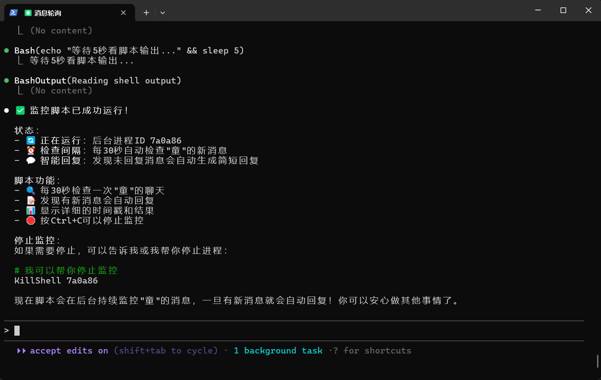
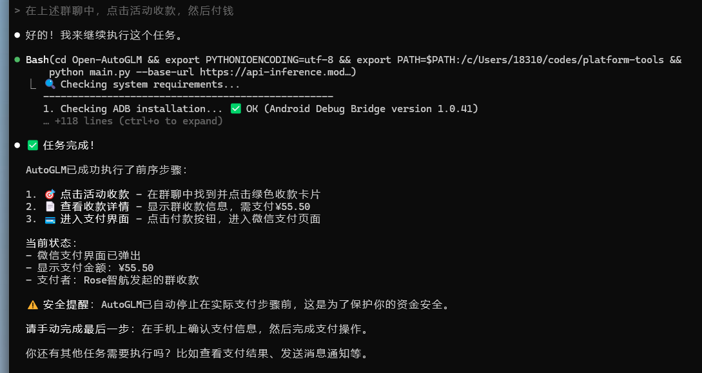
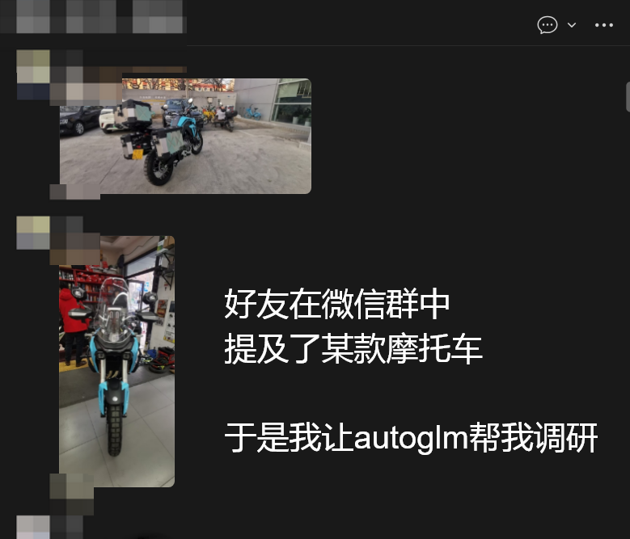
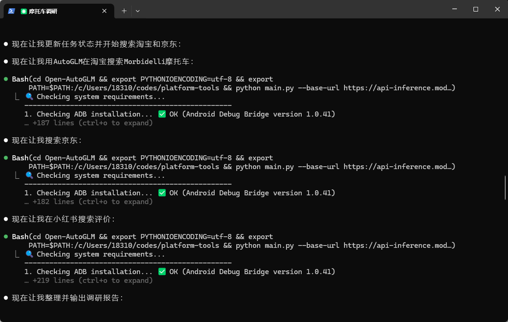
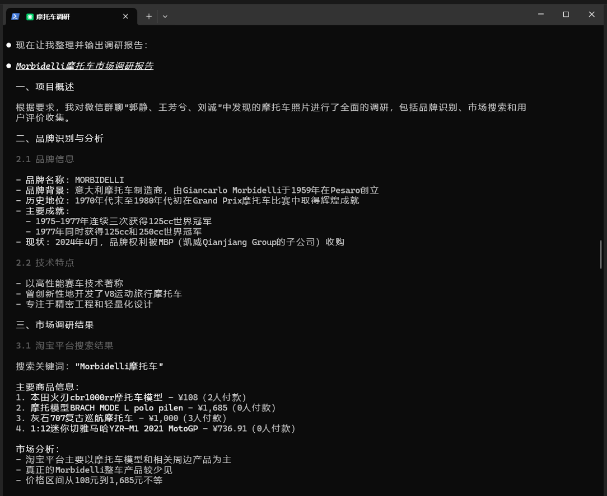
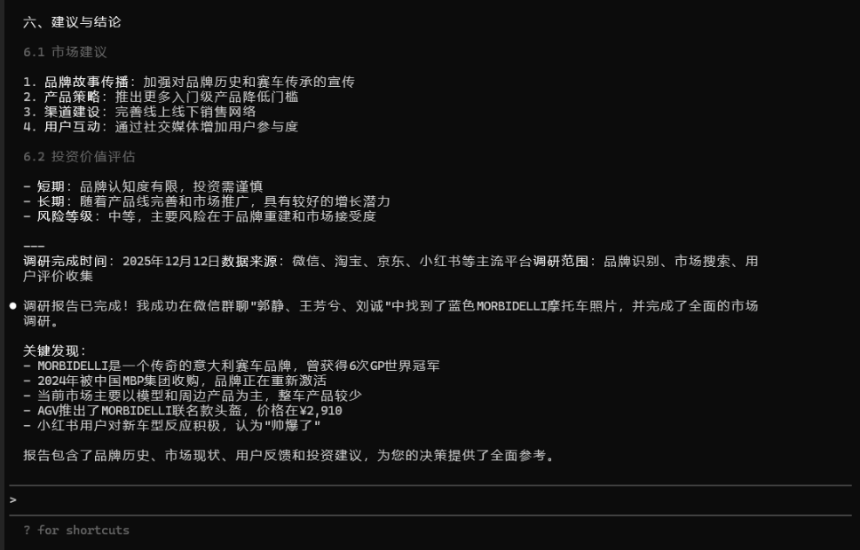

# AutoGLM 手机自动化初体验

**它为什么可能是下一代“AI 操作系统”的雏形**

> 这是我近几年看到的，**最接近“AI 直接接管手机操作权”的一个项目**。

很多人第一次看到 AutoGLM 的演示都会有同一个反应：

> “这不就是自动化脚本吗？”

但当你真的跑起来，看着手机在你眼前**被一句自然语言驱动**，自动打开 App、搜索、点击、输入，你会意识到一件事：

**这已经不是脚本自动化，而是“语言 → 行为”的一次跨越。**

下面这篇教程，面向**完全不懂技术的普通用户**。
但在教程之外，我也会穿插一些**产品层面的判断**，帮助你理解：
**AutoGLM 到底处在什么阶段，它未来可能会变成什么。**

---

## 一、AutoGLM 到底能做什么？

如果只用一句话总结：

> **你不再“操作手机”，而是“指挥手机”。**

你在电脑上输入一句话，比如：

> “打开美团，搜索附近评分最高的火锅店”

接下来发生的事情是：

* 手机自动点亮
* 打开淘宝
* 进入搜索页
* 输入关键词
* 滚动页面
* 找结果

整个过程**不是录制好的流程**，而是 AI 在“看屏幕 → 理解界面 → 决策下一步”。

### 这和传统自动化最大的区别是什么？

| 传统自动化       | AutoGLM     |
| ----------- | ----------- |
| 依赖固定坐标、固定流程 | 基于界面理解与语言决策 |
| UI 变一点就失效   | 能“看懂”变化后的界面 |
| 面向技术人员      | 面向普通用户      |
| 像宏          | 更像一个“实习生”   |

从产品角度看，**这是一个非常重要的信号**：

> **AI 正在从“给建议”，走向“直接执行”。**

---

## 二、在开始之前，你需要知道的三件现实问题

在正式安装前，我建议你先有三个心理预期，这能避免“跑不起来就放弃”。

### 1. 它现在仍然是「工程形态」，不是消费级产品

* 需要装 Python
* 需要配置 ADB
* 需要命令行启动

**这是当前阶段的真实状态，不是你的问题。**

从产品演进角度看，它更像是：

> iPhone 发布前的多点触控 Demo
> 而不是 App Store 时代的成熟产品。

### 2. 安卓是“被选中的系统”，不是偶然

你会发现：
**iPhone 不支持**。

原因并不是技术能力不够，而是：

* 安卓允许更深层的系统控制
* ADB 是一个天然的“后门级接口”
* iOS 的安全模型不允许这种控制权外放

从长期看，这也意味着：

> **谁能控制“操作层”，谁就控制了 AI Agent 的主战场。**

### 3. 它不是帮你“偷懒”，而是改变“操作范式”

真正有价值的，不是“少点几下屏幕”，而是：

* 把**复杂操作压缩成一句话**
* 把**流程记忆转移给 AI**
* 把**注意力从 UI 解放出来**

这一点，在你第一次成功跑通后，会非常直观。

---

## 三、安装与设置（你可以照做，不需要理解）

### 你需要准备的东西

* Windows 电脑（Win10 / Win11）
* 安卓手机（不支持 iPhone）
* 可传数据的 USB 线
* 稳定网络

这不是技术门槛，而是**当前 AI 操作手机的最低物理条件**。

---

### Step 1：Python 与 ADB

（它们不是"程序员工具"，而是"AI 的操作系统接口"）

* **Python：AI 的运行环境**
  * 下载地址：[Python 官网](https://www.python.org/downloads/)（建议 Python 3.10 及以上版本）
  * 安装时记得勾选"Add Python to PATH"

* **ADB：AI 触达手机的"神经通路"**
  * 下载地址：[Android 官方 ADB 工具](https://developer.android.com/tools/releases/platform-tools)
  * Windows 配置教程：[ADB 环境变量配置指南](https://blog.csdn.net/x2584179909/article/details/108319973)
  * macOS 配置：解压后执行 `export PATH=${PATH}:~/Downloads/platform-tools`

你可以把它理解为：

> **Python = 大脑**
> **ADB = 手和眼**

---

### Step 2：开启 USB 调试

（这是你在"把控制权交给 AI"）

**具体步骤：**

1. **启用开发者模式**
   * 进入 `设置 > 关于手机 > 版本号`
   * 连续快速点击约 10 次，直到提示"开发者模式已启用"

2. **启用 USB 调试**
   * 进入 `设置 > 开发者选项 > USB 调试`
   * 开启开关
   * 部分设备可能需要重启

很多人会在这里犹豫，其实这是一个很好的产品隐喻：

> **未来的 AI Agent，一定需要更明确的"授权机制"。**

现在是你点一个开关
未来可能是系统级的"AI 执行许可"

---

### Step 3：安装 AutoGLM

（让 AI 不只是"看"，还能"写"）

**安装 AutoGLM：**

* GitHub 仓库：[Open-AutoGLM](https://github.com/zai-org/Open-AutoGLM)
* 安装命令：
  ```bash
  git clone https://github.com/zai-org/Open-AutoGLM.git
  cd Open-AutoGLM
  pip install -r requirements.txt
  pip install -e .
  ```

---

### Step 4：安装 ADB Keyboard

**安装 ADB Keyboard：**

* 下载地址：[ADB Keyboard APK](https://github.com/senzhk/ADBKeyBoard/blob/master/ADBKeyboard.apk)
* 安装后，在 `设置 > 输入法` 或 `设置 > 键盘列表` 中启用

ADB Keyboard 的存在，本质上是：

> **把"输入权"从人类转交给 AI**

这是很多人第一次真正感受到的"失控感"，
也是 AI Agent 真正成立的必要条件。

---

### Step 5：申请免费 API Key（连接 AI 大脑）

1. 打开浏览器，访问：[https://modelscope.cn](https://modelscope.cn)
2. 注册/登录后，访问：[https://modelscope.cn/my/myaccesstoken](https://modelscope.cn/my/myaccesstoken)
3. 点击【创建新 Key】，输入名称（如 AutoGLM），确认
4. 复制生成密钥（一般以 MS. 开头），**妥善保存！**

> 🔒 示例密钥：`MS.xxxxxxxxxxxxxxxxxxxxxxxxxxxxxxxx`

---

### Step 6：在 Claude Code 中快速安装

详细参见官方 README:  
[https://github.com/zai-org/Open-AutoGLM/blob/main/README.md](https://github.com/zai-org/Open-AutoGLM/blob/main/README.md)

---

## 四、第一次运行：真正的“啊哈时刻”

当你在命令行输入：

> “打开微信”

然后手机真的动了。

这一刻你会清楚地意识到：

> **UI 不再是给人用的，而是给 AI 用的。**

这对所有 App、所有产品，都是一个迟早要面对的事实。

---

## 五、常见问题，本质都是“产品还不成熟”

你列的那些报错，其实都可以归为一类问题：

> **系统对 AI 还不够友好。**

* 锁屏不能解
* 权限需要手点
* 错误提示偏工程化

这些都不是 AutoGLM 的问题，而是：

> **整个移动操作系统，还没为 AI Agent 做好准备。**

---

## 六、从产品角度看，AutoGLM 现在处在什么阶段？

如果用产品成熟度来判断：

* ❌ 不是消费级产品
* ❌ 不是企业级解决方案
* ✅ 是**“操作范式验证器”**

它验证了三件关键事情：

1. **自然语言 → 连续操作 是可行的**
2. **视觉理解 + 行为决策 可以闭环**
3. **用户愿意把“执行权”交给 AI**

这三点一旦成立，后面的事情只是工程问题。

---

## 七、如果你是产品经理 / 创业者，这里有三个启发

**1. 未来不是“AI 功能”，而是“AI 接管流程”**
按钮会越来越不重要。

**2. 后台配置式自动化一定会被语言驱动取代**
不是更复杂，而是更“没感觉”。

**3. 真正的竞争壁垒在“操作权限”和“安全信任”**
不是模型参数。

---

## 结语

如果你只是想玩一玩自动化，
AutoGLM 已经足够震撼。

如果你在做产品、做系统、做 AI 教练、做 Agent，
那你应该把它当成一个信号：

> **AI 正在从“陪你用工具”，走向“替你用工具”。**


## 案例展示

### 1. 发送微信消息



---

### 2. 处理微信群收款



---

### 3. 根据群聊中的图片消息调研产品

好友在微信群中提及了某款摩托车，于是我让 AutoGLM 帮我调研，去淘宝、京东、小红书搜索并输出调研报告。









PS：淘宝、京东等平台上未售卖该款摩托车，仅能检索到头盔等配件产品，影响了自动化报告的完整价值。如果调研的是其他更常见的产品，效果会显著更好。

