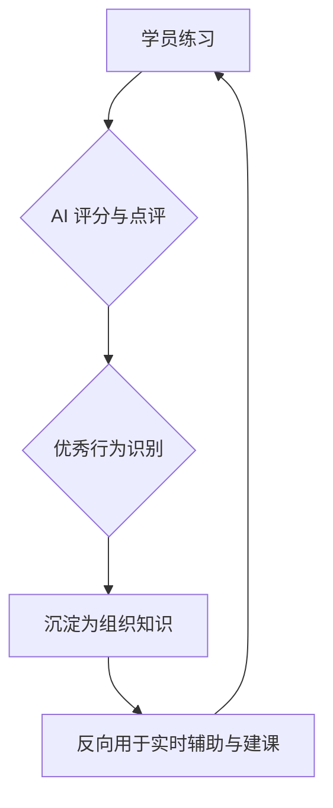

# 一、传统企业培训产品是如何运作的

传统企业培训产品的核心目标，是规模化地交付标准化内容。其典型形态是以课程、题库和考试为中心，通过预设流程组织学习路径。

**在这一体系中：**

*   **学习流程：** 被拆解为“上课—练习—考试—评估”的线性流程；
*   **系统职责：** 主要职责是管理内容与进度；
*   **核心角色：** 教练与讲师承担真正的判断与指导工作；
*   **衡量指标：** 产品衡量的重点是完成率、通过率与覆盖率。

这种模式在“知识稀缺、师资有限”的时代是有效的，但它天然存在几个**结构性限制：**

*   练习与反馈存在明显时间差；
*   个体差异难以被系统性照顾；
*   真实业务场景难以被高质量复现；
*   培训效果更多停留在“学没学”，“过没过”，而非“会不会”。

# 二、什么是 AI-Native 产品

AI-Native 产品，并不是在原有产品上叠加 AI 功能，而是从一开始就假设 AI 是系统的**智能中枢**。

它的核心特征不在于“用了什么模型”，而在于以下**三点：**

*   系统可以实时理解用户行为；
*   系统能够在交互过程中做出判断与反馈；
*   产品流程不是预设的，而是动态生成的。

**在 AI-Native 产品中：**

*   **AI 角色：** 不再是工具或插件，而是持续参与交互的主体；
*   **产品定位：** 不只是承载功能，而是一个能够引导、纠偏、强化行为的系统；
*   **价值体现：** 不体现在“完成了什么”，而体现在“发生了什么改变”。

# 三、如何做企业培训的 AI-Native 产品

将企业培训转向 AI-Native，本质上是从**“课程交付系统”转向“能力塑造系统”**。

这意味着**三个关键转变：**

1.  **训练单位的转变：** 从“课程 / 任务”为单位，转向以一次有效练习、一次行为调整为最小价值单位。
2.  **交互方式的转变：** 从点击和提交，转向以自然语言对话为核心的交互方式，使练习本身更接近真实工作场景。
3.  **反馈机制的转变：** 从事后评价，转向练习中的即时辅助与过程反馈，让学习在发生的当下就被校正和强化。

**在这样的体系下：**

*   AI 承担教练角色，实时引导学习进程；
*   学员不再只是执行者，而是通过试错完成能力提升；
*   组织经验可以被持续沉淀，并反向用于下一轮训练。

AI-Native 的企业培训产品，最终目标不是“教完”，而是**“改变发生”**。

# 四、为何传统培训需“重构”而非“升级”

我们认为，传统企业培训产品的症结并非内容匮乏，而是其核心的学习发生机制已无法适应时代发展。

具体而言，面对千变万化的一线业务场景，传统模式难以穷尽所有知识点并确保内容始终贴近实践。更重要的是，在 AI 技术日益成熟的今天，知识本身已不再稀缺，真正有价值的是**即时、可行动、贴近真实场景的反馈**。如同在异国咖啡馆，店员即时补上的“Latte?”，这种反馈的效力远超事后学习。

因此，如果只是给原有培训系统叠加 AI 点评或内容生成，本质仍是旧范式下的效率优化，无法根本解决以下**核心问题：**

*   学员练习不足，实践脱离实际。
*   管理端建课成本高昂，内容复用性差。
*   学习效果难以量化，无法持续提升。

我们的选择并非功能升级，而是一次彻底的**AI-Native 产品范式迁移**。

# 五、核心设计原则

我们明确了以下**核心产品原则：**

1.  **减少界面交互，以 chat 为核心**
2.  **以提升 AI 教练的智能为核心**
3.  **让 AI 教练无处不在，越用越聪明**

所有后续功能设计，均围绕这三条原则展开。

# 六、关键重构

## 6.1 实时辅助——让“练习过程”发生改变

### 传统模式的缺陷

*   学员练习与学习是割裂的；
*   金牌话术、优秀示例只能“事后看”；
*   练的时候最需要帮助，却最孤立。

### AI-Native 的解法：实时辅助机制

我们在练习过程中引入**实时辅助机制**，主要包括：

*   **阶段目标提示：** 系统能够识别当前的对话进展，主动提示学员“当前阶段的目标是什么”（例如：需求挖掘阶段，提示学员多问开放式问题），解决学员“不知道该说什么”的卡点。
*   **产品信息提示：** 当对话涉及具体产品参数时，AI 自动推送相关产品知识，辅助学员准确应答。
*   **金牌话术推荐：** 基于上下文动态推荐优秀话术，结合企业知识库，实现“边练边学”的闭环。

### 设计取舍

我们刻意避免把 AI 做成“随时插话的老师”，而是：

*   **只在关键决策点介入；**
*   提供“可选建议”，而非强制纠正；
*   保留学员的试错空间。

> **学习不是被替代，而是被放大。**

## 6.2 对话式建课——让“建课”本身 AI-Native 化

### 问题洞察

在传统 LMS 中，建课是一个高度专业化、配置密集的工作：

*   培训师需要理解结构、字段、规则；
*   一线业务专家很难参与内容共建；
*   建课成本高，导致内容更新缓慢。

### 核心决策

我们首次引入**「与 AI 对话即建课」**的模式，将建课从“配置行为”转变为“表达行为”。

### 落地方式

*   **AI 驱动的知识库创建向导：** 通过问答式向导，基于公司背景信息和用户回答自动生成知识库。
*   **对话式建课与编辑：** 培训师通过自然语言描述目标、场景、学员画像，AI 自动生成课程结构。更重要的是，支持**对话式编辑**，用户可以直接表达“我觉得这个客户太温和了”，AI 即自动调整角色设定，而非反复进配置页修改参数。
*   **所见即所得：** 左侧实时预览课程结构与内容，右侧与 AI 助手对话调整，极大降低了认知负荷。

### 产品思考

这一步的关键不是“生成内容”，而是**降低认知门槛**：

> 如果一个系统只有专家能用，它永远无法成为组织能力的基础设施。

## 6.3 学员自主练（UGC）——重构内容生产机制

### 为什么要做 UGC

在真实业务中，最有价值的案例往往来自一线：

*   新客户异议；
*   临场应对方式；
*   非标准场景。

传统系统中，这些内容很难被结构化沉淀。

### 我们的做法

*   **C 端建课（学员自主练）：** 赋予学员自主权，使其能通过简单的对话，根据个人遇到的真实难点（如“搞定一个难缠的药店老板”）快速创建 AI 客户进行针对性练习。
*   **全员热练：** 建立自下而上的内容贡献机制，学员创建的高质量实战案例，经过轻量审核即可沉淀为组织共享的课程。

### 产品价值

*   内容从“自上而下分发”变为“自下而上涌现”；
*   AI 成为“内容结构化引擎”；
*   组织经验开始真正可积累、可复用。

## 6.4 闭环反馈体系——让数据真正“反哺系统”

### 设计目标

我们不希望评分只是“打分”，而是成为系统进化的燃料。

### 核心设计

*   **话术萃取与推荐闭环：** 系统不仅打分，更重要的是从高分练习中自动萃取“金牌话术”，并反向推荐给其他学员，让组织的最佳实践自动流动。
*   **基于报告问 AI 教练：** 学员查看评分报告时，可以针对具体的扣分点直接向 AI 提问（“我刚才哪里说得不对？应该怎么改？”），获取个性化的深度辅导。
*   **逐句点评：** 提供细致到单句的反馈与改进建议，而非笼统的总评。

### 闭环机制

> 这是从**“评估系统”到“自学习系统”**的关键一步。

# 七、全场景覆盖：兼顾存量与变革的训练闭环

在推动 AI-Native 变革的同时，我们也兼顾了企业培训现有的刚需与习惯，构建了**全场景覆盖的训练体系：**

1.  **AI 客户（RolePlay）：** 核心变革模块，专注于真实对话与策略训练。
2.  **AI 考官：** **传统考核的智能化升级**。支持 AI 根据文档自动生成试题（涵盖问答题、选择题、计算题），既保留了企业习惯的标准化考核形式，又极大提升了出题与阅卷效率。
3.  **演讲训练：** 支持 PPT 上传与互动指标监测，覆盖产品宣讲、方案汇报等“单向输出”场景。
4.  **话术朗读 / 背诵：** 基础能力巩固。

此外，我们引入了**防作弊**（人脸检测等）机制，确保作为企业级应用的严肃性与公平性。

这四个模块共同构成了 **学 → 练 → 考 → 评 → 再练** 的完整闭环。

# 八、总结：我们真正做对的三件事

1.  **没有把 AI 当功能，而是当系统大脑**
2.  **用对话重构了人与系统的关系**
3.  **让组织能力第一次具备“自我进化”的可能**
